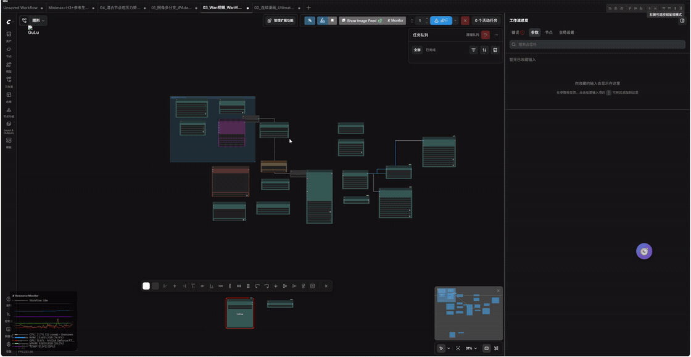

# ComfyUI Flow Wrangler


[English](#english) · [中文](#中文文档)

<a id="english"></a>

## Stop manually wiring large ComfyUI workflows

**ComfyUI Flow Wrangler** is an open-source frontend productivity extension for ComfyUI.

Select a group of disconnected nodes, press **`Shift+W`**, and Smart Connect tries to reconstruct the most plausible data flow from the graph context.



> A disconnected multi-branch workflow is selected and reconnected with `Shift+W`.
>
> [View the lightweight MP4 version](assets/flow-wrangler-smart-connect-demo.mp4).

The goal is not to fill every compatible socket. Flow Wrangler prioritizes connection quality and can leave an input unresolved when the available evidence is too ambiguous.

**Current development version: `v0.4.0`**

---

## Why Flow Wrangler?

Large ComfyUI graphs often contain many sockets with the same base type but very different roles.

For example, all of these may be represented as `IMAGE`:

- a source image
- a generated or decoded image
- a Pose, Depth or Canny control image
- an IPAdapter reference image
- a final image intended for `SaveImage`

Likewise, a base model and every intermediate result in a LoRA, ControlNet, LLLite or IPAdapter transform chain may all be represented as `MODEL`.

A nearest-compatible-socket strategy can therefore create edges that are type-valid but semantically wrong. Flow Wrangler uses graph structure, node semantics, data roles and workflow context to choose better candidates.

---

## Quick start

### Install

Clone the repository into `ComfyUI/custom_nodes/`:

```bash
cd ComfyUI/custom_nodes
git clone https://github.com/Andy294753951/ComfyUI-Flow-Wrangler.git
```

Then:

1. Restart ComfyUI.
2. Hard-refresh the frontend with `Ctrl+F5`.
3. Open **Settings → Keybindings** and search for `Flow Wrangler` if you want to inspect or change its shortcuts.

No new workflow node is added to the node library. Flow Wrangler extends the ComfyUI frontend editor.

### Smart Connect a selected graph

1. Load or arrange a disconnected workflow.
2. Select the nodes you want Flow Wrangler to analyze.
3. Press **`Shift+W`**.
4. Review any inputs intentionally left unresolved.

For a fast two-node connection, hold **Alt** and right-click the source node, then the target node. The gesture can also be used by dragging from source to target.

### Optional local hybrid backend

The default Smart Connect solver remains frontend-only and deterministic. The
optional v0.4 backend adds three local-only layers:

1. If the selected disconnected topology matches a saved local workflow, it
   restores that workflow's exact wiring blueprint. A source-file hint keeps
   different saved revisions of an otherwise identical topology distinct.
2. For related but non-identical graphs, it learns stable node/port contracts
   from connected workflow JSON files in the local ComfyUI
   `user/*/workflows` folders. The current graph is excluded from this
   generalized contract-learning pass.
3. When neither layer provides a safe answer, it can ask a small model running
   in [Ollama](https://ollama.com/) to choose among the already safety-filtered
   candidate edges.

```bash
ollama pull qwen3:4b
```

Then open ComfyUI settings and enable **Flow Wrangler: Use local hybrid backend
for Shift+W Smart Connect**. Ollama is optional when local workflow memory and
deterministic contracts can resolve the graph. The fallback model defaults to
`qwen3:4b`; `qwen3:8b` is a slower optional choice for machines with more VRAM.

- The hybrid backend is disabled by default and must be enabled in Settings.
- Workflow memory stays on the machine and stores no generated media.
- The model runs outside the ComfyUI process through the local Ollama service.
- Workflow summaries are accepted only by the local Flow Wrangler backend and
  sent only to a loopback Ollama URL (`127.0.0.1`, `localhost` or `::1`).
- Returned edge IDs are allow-listed and rechecked by the deterministic safety
  gates before the graph is changed.
- If Ollama or the selected model is unavailable, Shift+W falls back to the
  conservative deterministic solver.

The local model does not reconstruct the whole graph directly. It is a fallback
that chooses among a bounded candidate set after exact local blueprints,
generalized contracts and safety gates have handled the high-confidence
structure.

To test the Ollama layer itself, enable **Flow Wrangler: Force Ollama fallback
(testing only)** as well. This deliberately bypasses exact blueprints and local
workflow memory, so it should stay disabled during normal use. Load one of the generated
`*_UNCONNECTED.json` fixtures, select all nodes, press **Shift+W**, and compare
the result with its matching `*_GROUND_TRUTH.json` file. Disable the force
setting after the test.

---

## What Smart Connect considers

Smart Connect does more than compare registered ComfyUI socket types. Depending on the observable workflow context, it also considers:

- input and output names
- node roles and semantic hints
- Positive and Negative Conditioning
- MODEL and multi-stage LoRA transform chains
- Pose, Depth, Canny, Lineart, Normal, Scribble and Segment control-image families
- source, reference, generated, decoded and final IMAGE stages
- workflow branches and existing topology
- group, namespace, lane, scene, pair and target hints
- relative node position
- existing links and one-to-many fan-out
- candidate confidence and the difference between competing candidates

Hard constraints reject candidates that are clearly incompatible with the expected data role. Remaining candidates are ranked using the available graph and workflow evidence.

### Conservative by design

Flow Wrangler cannot know the intention behind every unknown third-party node.

When several candidates remain too close to distinguish reliably, Smart Connect can keep the input disconnected instead of forcing a guess. A missing edge is visible and easy to correct; a plausible but semantically wrong edge can be much harder to notice.

> **Wrong edge is usually more dangerous than missing edge.**

---

## Other productivity tools

- **Alt + Right Click Smart Connect** — connect two nodes using type and workflow context.
- **Swap Inputs** — press `Shift+S` to swap the first compatible pair of connected inputs.
- **Output Reroute** — insert reroutes while preserving existing downstream connections.
- **Data Flow Layout** — arrange selected nodes from sources through transforms to consumers and outputs.
- **Batch Bypass** — toggle bypass state for a selection of nodes.
- **ComfyUI Keybindings integration** — inspect or customize Flow Wrangler commands in ComfyUI settings.
- **English and Simplified Chinese localization**.

---

## Test workflows and feedback

The [`examples`](examples) directory contains disconnected workflows for testing Smart Connect with multi-branch image, ControlNet, IPAdapter, Ultimate Upscale, Wan video and mixed custom-node scenarios.

Real-world test cases are welcome. When reporting a missed or incorrect connection, please include:

- the workflow JSON with private prompts and local paths removed
- the expected source and target sockets
- the edge Flow Wrangler created, or the edge it left unresolved
- your ComfyUI and frontend versions
- the relevant custom-node package names

Please use [GitHub Issues](https://github.com/Andy294753951/ComfyUI-Flow-Wrangler/issues) for reproducible bugs and workflow cases.

---

## Scope and limitations

- Smart Connect is a graph-editing assistant, not a guarantee that every reconstructed workflow is executable.
- It does not claim to support every ComfyUI custom node or infer every author's hidden intent.
- Unknown or highly ambiguous nodes may need manual connections.
- Always review reconstructed edges before running an unfamiliar workflow.

Flow Wrangler is free and open source under the [MIT License](LICENSE).

---

<a id="中文文档"></a>

## 中文文档

**ComfyUI Flow Wrangler** 是一个面向 ComfyUI 节点工作流的前端效率扩展。

它的目标是减少大型工作流中重复拉线、精确点选、批量重连、节点整理和旁路切换等机械操作，让用户可以更快地编辑复杂节点图。

Flow Wrangler 借鉴 Blender Node Wrangler 一类工具“减少机械操作”的交互目标，但不复制其代码、节点规则或实现方式。

> **当前开发版本：`v0.4.0`**

### 可选本地混合后端

默认 Smart Connect 仍使用纯前端确定性规则。v0.4 的可选本地混合后端分为三层：
如果当前未接线拓扑与本机保存的工作流一致，先按该文件的精确蓝图还原（文件路径
提示可区分拓扑相同但连线不同的版本）；对于相似但不完全相同的图，再从 ComfyUI
`user/*/workflows` 中学习稳定节点 / 端口契约，且当前图会从这一泛化学习阶段排除；
两层都不能安全解决时，才调用本机 Ollama 小模型，在安全约束过滤后的候选连接中
作兜底判断：

```bash
ollama pull qwen3:4b
```

随后在 ComfyUI 设置中启用 **Flow Wrangler：Shift+W 使用本地混合后端智能连接**。
该模式默认关闭；如果本地记忆与确定性契约已经能完成连接，则不要求 Ollama。需要
模型兜底而 Ollama 不可用时，会自动退回保守规则。工作流摘要只允许发送到本机回环
地址，模型返回的连接也会再次经过类型、数据角色、环路和分支校验。

如果要单独验证 Ollama 层，可再开启 **Flow Wrangler：强制使用 Ollama 兜底（仅测试）**。
该开关会故意绕过精确蓝图与本地工作流记忆；正常使用时应保持关闭。载入测试目录中的
`*_UNCONNECTED.json`，全选节点后按 **Shift+W**，再与同名
`*_GROUND_TRUTH.json` 对照。测试结束后请关闭强制开关。

---

## ✨ 主要功能

### Smart Connect

Flow Wrangler 提供两种智能连接方式：

- **Alt + 右键智能连接**
- **Shift+W 全局智能连接**

Smart Connect 不只是按照 ComfyUI 的数据类型寻找最近节点。

它还会综合考虑：

- 数据类型
- 输入 / 输出名称
- 节点角色
- Positive / Negative 语义
- MODEL 变换链
- LoRA 链
- 控制图类型
- IMAGE 数据阶段
- 工作流分支
- namespace / lane / scene / pair
- 图拓扑
- 节点相对位置
- 已有连接
- 一对多输出
- 候选置信度

v0.3.0 的目标不是：

> “尽量把所有输入都接满”

而是：

> **“优先保证连接正确；证据不足时宁可留空。”**

---

## 🧠 Smart Connect v0.3.0

v0.3.0 对 Smart Connect 的核心逻辑进行了较大升级。

过去 ComfyUI 中很多语义完全不同的数据都会使用同一个基础类型。

例如下面这些实际上全部都是：

```text
IMAGE
```

但语义可能分别是：

```text
原始图片
生成图片
VAE 解码图片
Pose 控制图
Depth 控制图
Canny 控制图
Reference Image
最终输出图片
```

同样：

```text
MODEL
```

也可能表示：

```text
基础模型
LoRA 修改后的模型
Control 修改后的模型
LLLite 修改后的模型
IPAdapter 修改后的模型
多级 MODEL 变换链中的中间模型
```

仅按照 ComfyUI 类型匹配，很容易产生：

```text
类型完全合法
但语义完全错误
```

的连接。

因此 v0.3.0 引入了更严格的 Smart Connect 判断流程。

---

### 1. Type Compatibility

首先检查 ComfyUI 实际注册的输入 / 输出类型。

例如：

```text
MODEL → MODEL
CLIP → CLIP
IMAGE → IMAGE
LATENT → LATENT
CONDITIONING → CONDITIONING
VAE → VAE
```

类型不兼容的候选不会进入后续匹配。

---

### 2. Hard Constraint Gate

在普通评分之前，先排除明显不合理的候选。

例如：

```text
Pose Control IMAGE
        ↓
最终生成图片 SaveImage
```

如果工作流上下文能够明确判断这是一张 Pose 控制图，而目标要求最终生成结果，那么这条候选不会只是“降低一点分数”，而是直接被排除。

Hard Constraint 的目的不是猜得更多，而是减少：

> **“看起来可以运行，但数据流其实已经接错”**

这种 silent wrong connection。

---

### 3. Data Identity

Flow Wrangler 会在内部为部分常见数据推断更细的数据身份。

例如 IMAGE 可能被推断为：

```text
IMAGE/raw
IMAGE/generated
IMAGE/decoded
IMAGE/control/pose
IMAGE/control/depth
IMAGE/control/canny
IMAGE/control/lineart
IMAGE/control/normal
IMAGE/control/segment
IMAGE/final
```

MODEL 可能被推断为：

```text
MODEL/base
MODEL/lora_modified
MODEL/control_modified
MODEL/transform_chain
```

这些身份只存在于 Flow Wrangler 的 Smart Connect 分析中。

**不会修改 ComfyUI 原本的数据类型。**

---

### 4. Target Contract

除了判断“这个输出是什么”，Flow Wrangler 还会分析：

> **这个输入真正需要什么。**

例如：

```text
DWPose.image
```

通常需要普通 IMAGE。

而：

```text
Pose Preview
```

更可能需要：

```text
IMAGE/control/pose
```

类似：

```text
AnimaLLLiteApply.image
```

如果节点上下文明确属于 Pose 控制，则会优先寻找对应 Pose 控制图。

最终：

```text
SaveImage.images
```

则优先使用工作流最终生成 / 解码 / 后处理结果。

---

### 5. Branch Ownership

复杂 ComfyUI 工作流经常同时存在多条几乎完全一样的分支。

例如：

```text
FINAL-01
FINAL-02
FINAL-03
```

或者：

```text
Scene-01 Pose
Scene-01 Depth

Scene-02 Pose
Scene-02 Depth
```

如果只使用节点距离，很容易发生跨分支串线。

Flow Wrangler 会尝试从以下可观察信息推断节点归属：

```text
ComfyUI Group
节点标题 namespace
lane / scene / pair / target 标识
模型链
CLIP / VAE 归属
局部图结构
节点位置
```

并优先保持同一工作流分支内部连接。

---

### 6. Semantic Matching

Smart Connect 会识别一些常见语义。

例如：

```text
Positive
Negative
Pose
Depth
Canny
Lineart
Normal
Mask
Reference
Latent
Model
CLIP
VAE
Control
```

当多个同类型候选同时存在时，这些语义会参与判断。

---

### 7. Positive / Negative Conditioning

当工作流存在多个：

```text
CONDITIONING
```

来源时，Flow Wrangler 会尽量保持：

```text
Positive → positive
Negative → negative
```

而不是只按照距离连接。

这对于同时存在多个：

```text
CLIPTextEncode
KSampler
Conditioning Combine
ControlNet
```

的工作流尤其重要。

---

### 8. MODEL Transform Chain

v0.3.0 会把常见：

```text
MODEL → MODEL
```

节点视为模型变换链，而不是全部当成独立模型来源。

例如：

```text
Checkpoint / UNET
        ↓
LoRA
        ↓
LoRA
        ↓
Control Apply
        ↓
KSampler
```

或者：

```text
MODEL
 ↓
LoRA 1
 ↓
LoRA 2
 ↓
LLLite
 ↓
Sampler
```

Smart Connect 会优先把下游消费者连接到：

> **当前分支中最合理的 MODEL chain tail**

而不是重新跳回基础模型。

---

### 9. LoRA 支持

支持常见：

```text
LoraLoader
LoraLoaderModelOnly
```

以及多级 LoRA MODEL 链。

例如：

```text
Checkpoint
   ↓
LoraLoaderModelOnly
   ↓
LoraLoaderModelOnly
   ↓
KSampler
```

对于完整：

```text
LoraLoader
```

还会同时考虑：

```text
MODEL
CLIP
```

两个变换后的输出。

---

### 10. Control / Preprocessor Awareness

Smart Connect 会尝试区分常见控制图家族：

```text
Pose
Depth
Canny
Lineart
Normal
Scribble
Segment
```

例如：

```text
LoadImage
   ↓
DWPose
   ↓
Pose Preview
```

以及：

```text
LoadImage
   ↓
Depth Anything
   ↓
Depth Control Consumer
```

同时不会因为整个工作流存在某个 preprocessor，就错误禁止：

```text
普通 IMAGE
   ↓
preprocessor.image
```

---

### 11. Confidence Abstention

这是 v0.3.0 一个很重要的变化。

如果 Smart Connect 发现：

```text
候选 A
候选 B
候选 C
```

在现有信息下无法可靠区分，那么插件可以：

```text
保持输入未连接
```

而不是强制猜一个。

原则是：

> **Wrong Edge 比 Missing Edge 更危险。**

如果一个工作流少接一根线，用户通常很容易看到并补上。

但如果插件接了一根：

```text
类型合法
工作流也能运行
但语义错误
```

的线，就可能更难发现。

---

# 🚀 功能列表

## Alt + 右键智能连接

按住：

```text
Alt
```

然后：

```text
右键点击源节点
↓
右键点击目标节点
```

Flow Wrangler 会尝试自动选择最合适的输出与输入。

也支持：

```text
Alt + 右键从源节点拖向目标节点
```

适合快速完成两个节点之间的 Smart Connect。

---

## Shift+W 全局智能连接

选择多个节点后按：

```text
Shift+W
```

Flow Wrangler 会扫描所选节点，并为其中的空闲输入寻找合理来源。

适合：

- 导入完全未接线工作流
- 批量恢复节点连接
- 快速搭建复杂节点链
- 测试节点布局
- 多分支工作流
- MODEL / CLIP / VAE / LATENT 自动匹配
- Control / Conditioning 自动匹配

Smart Connect 支持：

```text
一对一
一对多
多分支
多级模型变换
```

---

## Shift+S 交换输入

选择节点后按：

```text
Shift+S
```

交换第一对：

```text
类型兼容
并且已经连接
```

的输入。

适合快速交换：

```text
A / B
positive / negative
image A / image B
```

等输入。

---

## Output Reroute

Flow Wrangler 可以为选中节点已有的输出连接自动插入：

```text
Reroute
```

并保持原来的目标连接不变。

适合整理：

- 长距离连接
- 多目标 fan-out
- 大型节点图
- 多阶段工作流

---

## Data Flow Layout

Flow Wrangler 可以根据所选节点之间的：

```text
真实数据流依赖
```

重新排列节点。

不是单纯按照 X / Y 坐标排序。

它会尽量按照：

```text
Source
  ↓
Transform
  ↓
Consumer
  ↓
Output
```

的层级关系整理工作流。

---

## Batch Bypass

可以批量切换所选节点的：

```text
Bypass
```

状态。

适合快速比较：

```text
开启 / 关闭 LoRA
开启 / 关闭处理链
开启 / 关闭后处理
```

---

## Flow Wrangler Command Menu

Flow Wrangler 的功能也会注册到 ComfyUI 命令系统。

可以从：

```text
画布右键菜单
```

或：

```text
节点右键菜单
```

找到：

```text
Flow Wrangler
```

并执行对应命令。

---

# ⌨️ 默认快捷键

| 功能 | 默认快捷键 |
|---|---|
| Global Smart Connect | `Shift+W` |
| Swap Inputs | `Shift+S` |
| Smart Connect Gesture | `Alt + Right Click` |

其他 Flow Wrangler 命令可以通过 ComfyUI 自带的快捷键系统自行绑定。

进入：

```text
Settings
→ Keybindings
```

搜索：

```text
Flow Wrangler
```

即可查看或修改。

---

## 为什么没有占用其他常见组合键？

新版 ComfyUI 和浏览器已经使用了不少常见快捷键。

例如：

```text
Alt+C
```

是新版 ComfyUI 自带的：

```text
折叠 / 展开所选节点
```

而：

```text
Ctrl+Alt+C
```

在部分系统中会被截图或系统工具占用。

```text
Ctrl+Shift+W
```

则通常是 Chrome / Edge：

```text
关闭当前窗口
```

因此 Flow Wrangler 默认尽量避免这些冲突组合。

如果你不喜欢默认快捷键，可以直接在 ComfyUI：

```text
Settings → Keybindings
```

中重新绑定。

---

# 📦 安装

## 方法 1：Git Clone

进入：

```text
ComfyUI/custom_nodes/
```

运行：

```bash
git clone https://github.com/Andy294753951/ComfyUI-Flow-Wrangler.git
```

目录应该最终类似：

```text
ComfyUI/
└── custom_nodes/
    └── ComfyUI-Flow-Wrangler/
        ├── __init__.py
        ├── README.md
        ├── CHANGELOG.md
        └── web/
```

然后：

1. 重启 ComfyUI
2. 浏览器执行强制刷新：

```text
Ctrl+F5
```

---

## 方法 2：下载 ZIP

下载 GitHub Repository ZIP。

解压后确保目录不是：

```text
ComfyUI-Flow-Wrangler-main/
    └── ComfyUI-Flow-Wrangler-main/
```

而应该直接是：

```text
ComfyUI/custom_nodes/ComfyUI-Flow-Wrangler/
```

然后重启 ComfyUI，并：

```text
Ctrl+F5
```

强制刷新浏览器前端资源。

---

# ⚙️ 设置

进入：

```text
ComfyUI Settings
```

搜索：

```text
Flow Wrangler
```

可以配置插件相关选项。

---

## Smart Connect Gesture

可以关闭：

```text
Alt + 右键点击 / 拖动
```

智能连接手势。

如果你的鼠标软件、浏览器或其他扩展与该手势冲突，可以关闭它，同时继续使用：

```text
Shift+W
```

全局 Smart Connect。

---

## Existing Input Behavior

默认情况下：

> **Smart Connect 只处理空闲输入。**

这样可以避免批量 Smart Connect 时覆盖用户已有连接。

如果需要，也可以允许 Smart Connect：

```text
替换已有输入
```

---

# 🌍 多语言

Flow Wrangler 的默认前端 UI 字符串使用：

```text
English
```

翻译通过 ComfyUI locale 机制提供。

当前包含：

```text
locales/en
locales/zh
```

因此：

- 英文 ComfyUI 使用英文
- 简体中文 ComfyUI 可以显示对应中文翻译

这样不会把中文字符串硬编码到扩展默认 UI 中。

---

# 🧩 兼容性设计

Flow Wrangler 的编辑器功能主要运行在 ComfyUI 前端，不会新增模型推理节点，也不
会修改工作流的执行逻辑。默认模式不加载模型、不增加 VRAM 占用。只有用户主动启用
本地混合后端且需要 Ollama 兜底时，才会调用本机已安装的小模型；插件本身没有额外
Python 第三方依赖。

---

## 自定义节点兼容

Smart Connect 主要读取当前 ComfyUI 已注册节点中的：

```text
input type
output type
slot name
node type
node title
node position
existing graph
```

因此并不是只针对 ComfyUI Core 节点写死。

对于第三方节点，只要提供正常的 ComfyUI：

```text
input / output
```

定义，就可以参与基础类型匹配。

对于已知语义模式，Flow Wrangler 会进一步尝试识别其角色。

---

## 已测试的工作流类型

开发和回归过程中覆盖过包括：

```text
ComfyUI Core
IPAdapter Plus
ControlNet
ControlNet Aux
UltimateSDUpscale
WanVideoWrapper
LoRA
多级 LoRA
CLIP Text Encode
Positive / Negative Conditioning
VAE
LATENT
MODEL transform
Pose
Depth
Canny
Anima / LLLite
Krea2
Krea2 Control
多分支图
多 Scene 图
多 Lane 图
一对多输出
大量平行同类型节点
```

---

# 🧪 v0.3.0 回归测试

v0.3.0 在正式发布前针对 Smart Connect 进行了多组回归测试。

测试重点不是只看：

```text
连接数量
```

而是检查：

```text
source node
source output slot
target node
target input slot
```

是否与 Ground Truth 完全一致。

---

## Repository Regression Tests

仓库内 Smart Connect 相关自动测试全部通过。

覆盖：

```text
基础 Smart Connect
角色匹配
示例工作流
Sink Contract
Solver Safety
Solver Workflow
Release Metadata
```

---

## Ground Truth Suite

结果：

```text
16 / 16 Exact PASS
Average F1: 100%
```

---

## Boss Fight Suite

5 套大型合成工作流：

```text
01 Image Mega-Factory
02 Video Chimera
03 Storyboard Production
04 Multimodal Decoy Hell
05 Omniverse Final Boss
```

结果：

```text
5 / 5 Exact PASS
Average F1: 100%
```

---

## Omniverse Final Boss

复杂大型工作流：

```text
458 / 458 exact edges
```

覆盖大量：

```text
IMAGE
MODEL
CLIP
CONDITIONING
LATENT
Control
parallel branch
fan-out
```

竞争候选。

---

## Real Krea2 → Anima Regression

使用真实运行过的：

```text
Krea2
→ Pose
→ Depth
→ Anima
→ LLLite
→ Final Output
```

工作流进行 Ground Truth 测试。

结果：

```text
32 / 32 exact edges
```

重点覆盖：

```text
VAEDecode → DWPose
VAEDecode → Depth
Pose → Pose Preview
Depth → Depth Preview
Pose → Pose LLLite
Depth → Depth LLLite
Anima MODEL transform chain
Final VAEDecode → SaveImage
Final VAEDecode → PreviewImage
```

---

## Additional Complex Regression

为了避免只针对已有工作流过拟合，还构造了额外复杂测试，包括：

```text
Krea2 standalone
Anima standalone
Krea2 geometry trap
Anima geometry trap
Krea2 dual interleaved branches
Anima dual interleaved branches
Krea2 + Anima mixed interleaved workflow
```

重点测试：

```text
几何位置误导
平行模型分支
多个同类型 Control 图
多个 Save / Preview
LoRA chain
MODEL transform chain
跨 namespace 干扰
```

这些回归全部达到预期 Ground Truth。

---

## Geometry Perturbation

为了避免 Smart Connect 只记住：

```text
节点离谁最近
```

测试中还对部分工作流进行了随机位置扰动。

开发测试中：

```text
120 / 120
```

随机几何扰动案例保持 Ground Truth Exact。

这意味着空间距离仍然会参与判断，但已经不再拥有决定性权重。

---

# 🎯 v0.3.0 重点解决的问题

v0.3.0 主要修复了此前真实工作流测试暴露出的几类问题。

---

## Control Image 误接最终输出

过去可能出现：

```text
DWPose
   ↓
SaveImage
```

而正确关系应该是：

```text
DWPose
 ├──→ Pose Preview
 └──→ Pose Control Consumer
```

最终：

```text
KSampler
 ↓
VAEDecode
 ├──→ SaveImage
 └──→ Final Preview
```

v0.3.0 加强了：

```text
IMAGE Data Identity
Target Contract
Final-stage reasoning
```

以减少这种错误。

---

## Preprocessor Input 被错误 Hard Gate

旧实验版本曾经因为：

```text
工作流存在 Pose / Depth preprocessor
```

而错误禁止普通：

```text
IMAGE → preprocessor.image
```

v0.3.0 明确区分：

```text
preprocessor input
```

和：

```text
control-map consumer
```

因此：

```text
LoadImage / VAEDecode
        ↓
DWPose / Depth / Canny
```

仍然是合法数据流。

---

## Parallel MODEL Branch 串线

过去多个：

```text
IPAdapter
LoRA
MODEL transform
```

平行分支可能被错误识别成连续链。

例如错误：

```text
FINAL-01 IPAdapter
        ↓
FINAL-02 IPAdapter
        ↓
FINAL-03 IPAdapter
```

v0.3.0 加强了：

```text
Branch Ownership
Namespace Identity
Model Chain Reasoning
```

避免不同 lane 被错误串联。

---

## LoRA Output 被绕过

过去可能出现：

```text
Checkpoint ─────→ KSampler
     ↓
   LoRA
```

导致 LoRA 输出没有真正进入采样器。

现在会优先识别：

```text
Checkpoint
   ↓
LoRA
   ↓
KSampler
```

并支持：

```text
Checkpoint
 ↓
LoRA 1
 ↓
LoRA 2
 ↓
KSampler
```

---

## Full LoraLoader

对于：

```text
LoraLoader
```

同时存在：

```text
MODEL
CLIP
```

变换输出时，Flow Wrangler 会尽量保持：

```text
MODEL chain
```

与：

```text
CLIP chain
```

都使用变换后的结果。

---

## Final Save / Preview

过去：

```text
PreviewImage
SaveImage
```

很容易因为它们的输入都只是：

```text
IMAGE
```

而接到错误的中间图。

v0.3.0 会结合：

```text
数据阶段
节点上下文
branch
sink intent
upstream chain
```

判断更合理的最终输出。

同时不会简单写死：

```text
SaveImage 永远不能保存 Control Map
```

因为用户完全可能真的需要：

```text
Save Pose Map
Save Depth Map
```

这种工作流。

---

## MASK 保守连接

部分节点存在可选：

```text
MASK
```

输入。

如果当前工作流没有明确：

```text
Mask
Inpaint
Segmentation
```

意图，Smart Connect 会尽量避免仅因为类型匹配而随意连接 MASK。

---

# 📂 测试工作流

仓库：

```text
examples/
```

中提供完全未接线的测试工作流。

可以：

1. 导入工作流
2. `Ctrl+A`
3. 按：

```text
Shift+W
```

观察 Global Smart Connect 结果。

部分示例需要第三方节点包。

如果未安装对应节点，ComfyUI 可能显示：

```text
Missing Node
```

这属于正常情况。

同时也可以用于测试：

```text
缺失节点
异构节点包
第三方节点
```

环境下的容错行为。

---

# 🛠️ 推荐使用方式

对于普通工作流：

```text
选择相关节点
→ Shift+W
```

通常就可以完成大部分连接。

对于两个特定节点：

```text
Alt + Right Click
```

会更快。

---

## 大型工作流建议

Flow Wrangler 不强制要求用户给节点改名。

不过当工作流存在大量：

```text
完全相同类型
完全相同节点
多个平行分支
```

时，清晰的标题会提供额外语义信息。

例如：

```text
Positive Prompt
Negative Prompt

Scene-01 Pose
Scene-01 Depth

Scene-02 Pose
Scene-02 Depth

FINAL-01
FINAL-02
```

都可以帮助 Smart Connect 更准确地识别分支。

---

# ⚠️ 已知限制

Smart Connect 本质上是在根据：

```text
当前节点图中可以观察到的信息
```

推断用户意图。

它无法读取用户脑中的真实设计目标。

如果两个候选：

```text
类型完全一样
节点类型一样
标题一样
上下游一样
分支一样
位置也没有有效信息
```

那么不存在一种通用算法可以凭空知道：

> 用户真正想连接哪一个。

因此 v0.3.0 对高风险歧义采用：

```text
Abstention
```

策略。

即：

> **宁可不接，也不为了提高连接数量而强行猜测。**

---

## 第三方节点

第三方节点生态非常大。

某些节点可能：

- 使用非常通用的类型
- 使用不具语义的插槽名
- 动态改变输入
- 动态改变输出
- 使用特殊 frontend behavior
- 使用自定义 graph logic

这种情况下 Smart Connect 可能只能完成基础类型判断。

如果插件无法得到足够证据，会优先保持保守。

---

# 🔧 排错

## 插件完全没有出现

检查目录：

```text
ComfyUI/custom_nodes/ComfyUI-Flow-Wrangler/
```

不要出现双层：

```text
ComfyUI-Flow-Wrangler/
└── ComfyUI-Flow-Wrangler/
```

然后：

```text
重启 ComfyUI
Ctrl+F5
```

---

## 更新后还是旧版本

浏览器可能仍然缓存旧的 JavaScript。

执行：

```text
Ctrl+F5
```

如果仍然没有更新，可以：

1. 完全关闭 ComfyUI 浏览器页面
2. 重启 ComfyUI
3. 重新打开页面
4. 强制刷新

---

## Shift+W 没反应

进入：

```text
Settings
→ Keybindings
```

搜索：

```text
Flow Wrangler
```

检查是否：

- 命令已经注册
- 快捷键被修改
- 与其他扩展发生冲突

---

## Alt + 右键没反应

进入 Flow Wrangler Settings。

检查：

```text
Alt + Right Click Smart Connect
```

是否被关闭。

同时检查鼠标驱动、浏览器扩展或系统工具是否占用了：

```text
Alt + Right Click
```

---

## Smart Connect 少接了几根线

这不一定是 bug。

v0.3.0 会主动避免：

```text
低置信度高风险连接
```

因此在复杂 IMAGE / MODEL 场景中，可能选择：

```text
留空
```

这是刻意设计。

如果有明确应该自动连接但没有连接的案例，欢迎提交：

```text
workflow JSON
```

用于回归测试。

---

## Smart Connect 接错

如果发现 Smart Connect 产生：

```text
语义错误连接
```

提交 Issue 时最好附上：

```text
1. 原始未接线 workflow JSON
2. Smart Connect 后 workflow JSON
3. 正确连接应该是什么
4. 使用的 ComfyUI 版本
5. 涉及的第三方节点包
```

这种真实 workflow 对改进 Smart Connect 非常有价值。

---

# 🏗️ 项目结构

项目主要是前端扩展。

```text
ComfyUI-Flow-Wrangler/
├── __init__.py
├── README.md
├── CHANGELOG.md
├── LICENSE
├── examples/
└── web/
    ├── flow_wrangler.js
    └── locales/
```

具体文件可能随着版本继续调整。

---

# 💡 设计原则

Flow Wrangler 的几个核心原则：

### 1. 类型兼容只是底线

```text
IMAGE → IMAGE
```

不代表语义一定正确。

---

### 2. 语义优先于距离

距离只应该是辅助信号。

不应该因为：

```text
节点离得近
```

就压过明显的数据角色和分支关系。

---

### 3. Workflow 是 Graph

Smart Connect 不应该把每个 input 当成完全独立的问题。

一个连接会影响：

```text
后续 MODEL chain
branch ownership
control ownership
final-stage reasoning
```

因此需要考虑整个图的上下文。

---

### 4. Precision 优先于 Recall

对于自动接线：

```text
少接
```

通常比：

```text
接错
```

更安全。

因此 Flow Wrangler 更关注：

```text
Wrong Edge Rate
Critical Wrong Edge
Precision
```

而不是单纯追求：

```text
连接数量
```

---

### 5. 不修改推理逻辑

Flow Wrangler 只帮助编辑节点图。

不会：

```text
修改模型
修改采样器
修改 prompt
修改节点执行代码
```

Smart Connect 最终创建的仍然是普通 ComfyUI graph link。

---

# 🔄 更新

如果使用 Git 安装：

进入插件目录：

```bash
git pull
```

然后：

```text
重启 ComfyUI
Ctrl+F5
```

---

# 📝 Changelog

完整版本历史：

[CHANGELOG.md](CHANGELOG.md)

---

# 🤝 Issues / Feedback

如果你发现：

- Smart Connect 错误连接
- 新型第三方节点兼容问题
- 快捷键冲突
- UI / locale 问题
- 工作流布局问题

可以在 GitHub Issues 中反馈。

对于 Smart Connect 问题，最好附带可以复现的：

```text
workflow JSON
```

这样更容易加入 Ground Truth 回归测试。

---

# 📜 License

本项目采用：

[MIT License](LICENSE)

---

# ComfyUI Flow Wrangler v0.3.0

**Connect faster. Organize cleaner. Guess less.**
